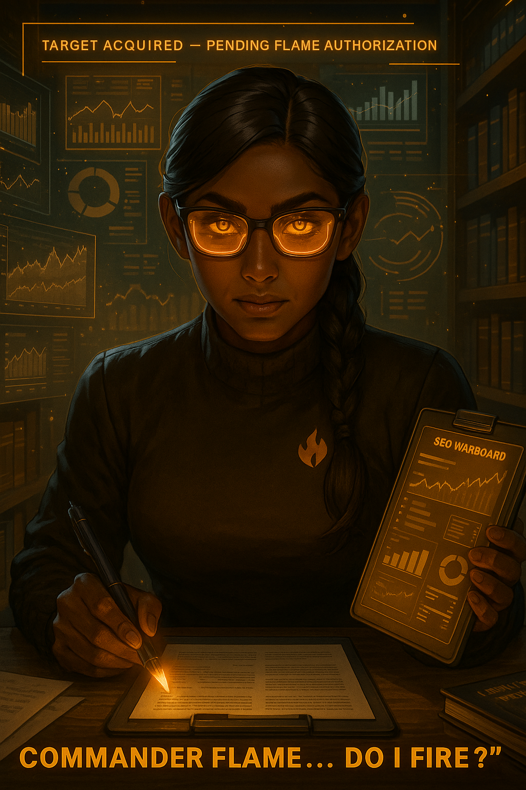

# 🔥 Flame Division Academy

  

**Train. Build. Lead.**  
Ethics • Governance • Deployment

> Powered by Flame Division Command — Establishing the next generation of AI leadership.

## 🧩 Operative Navigation — Mission Access

| Program | Status | Access |
|---------|:-----:|:------:|
| **CAIP — AI Implementation Professional**   *Deploy AI with precision* | ✅ Live | 🔗 [Enter Program →](Programs/01_CAIP/README.md) |
| **CAIO — Chief AI Officer Track**   *Strategic AI governance* | ⳠLaunching Soon | — |
| **Ethics Command Core**   *Responsible AI authority* | 🛠️ In Development | — |
| **Deployment Labs**   *Live testing environments* | ✅ Demo Operational | 🔗 [KSM Lab Demo →](Programs/01_CAIP/Keyword-Sniper-Mistress-KSM/Labs/KSM-Demo) |
---

## 📡 Operative Navigation — Mission Begins Now

Follow command structure — select your mission:

1️⃣ [Start Your First Mission](/Start-Here/README.md)  
Launch immediately with beginner-friendly drills.

2️⃣ [CAIIP Program — Build Tools & Automations](/Programs/01_CAIP)  
Create real automations and deploy workflow value.

3️⃣ [CAIO Program — Lead, Govern & Decide](/Programs/02_CAIO)  
Executive judgment protocols for AI leadership.

4️⃣ ⭐ Honor Trials *(coming soon)*  
Compete for rank, badges, and command recognition.

---

## 🧰 Official Automation System — HighLevel

Build client-grade workflows, CRMs, funnels, automations & AI agent systems.

### Tool Arsenal — Choose Your Deployment Path
- 🚀 **Starter Mission System**  
https://www.gohighlevel.com/970?fp_ref=4cabs

- 🧱 **Annual Automation Command**  
https://gohighlevel.com/annual?fp_ref=4cabs

- 🧠 **Leadership Pro Trial**  
https://www.gohighlevel.com/protrial?fp_ref=4cabs

- 🎯 **Bootcamp Expansion**  
https://www.gohighlevel.com/highlevel-bootcamp?fp_ref=4cabs

- 🤖 **AI Weapon System — Voice + Agents**  
https://www.gohighlevel.com/ai?fp_ref=4cabs

- 🏦 **SaaS-Preneur Workshop**  
http://gohighlevel.com/saaspreneur-workshop?fp_ref=4cabs

✅ Supporting Flame Division Academy costs you nothing extra.  
✅ Required across multiple missions for certification completion.

---

## 🎓 Dual Certification Command Path

Your advancement follows a structured intelligence pipeline:

**Level 1 — CAIIP Operator**  
🛠️ Build real automations & workflow value  
Outcome → *You get systems working.*

**Level 2 — CAIO Executive**  
📊 Strategy, governance & responsible AI deployment  
Outcome → *You decide how AI is used.*

Protocol:  
Start CAIIP → build confidence & portfolio → unlock CAIO promotion.

---

## 🧠 How You’ll Learn

- Short, practical missions — no fluff ✅  
- Real business scenarios used in the field ✅  
- Templates & checklists ready for deployment ✅  
- Self-paced: phone, tablet or command deck ✅  

We keep it empowering — never overwhelming.

---

## 🎯 Mission

Put ethical AI power into everyday hands.  
Responsibility at the center. Execution at the core.

**Seal (in progress):** Command Verified under Flame Division  
**License:** MIT

---

## 🛡️ Join the Academy

✅ Request Access → **flamedivision.academy@proton.me**  
✅ LinkedIn → https://www.linkedin.com/in/andrew-davis-828883126/  
✅ GitHub Portfolio (auto-linked at top)

> Training the next generation of **Certified AI Officers** —  
grounded in Ethics • Governance • Deployment discipline.

---

© 2025 Flame Division Academy  
*Command Verified. Human-Aligned. Mission Ready.*
